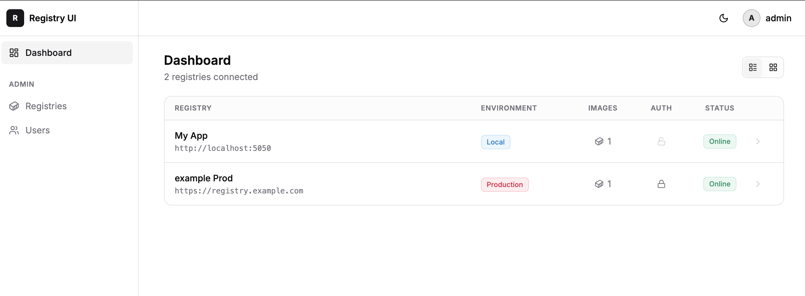
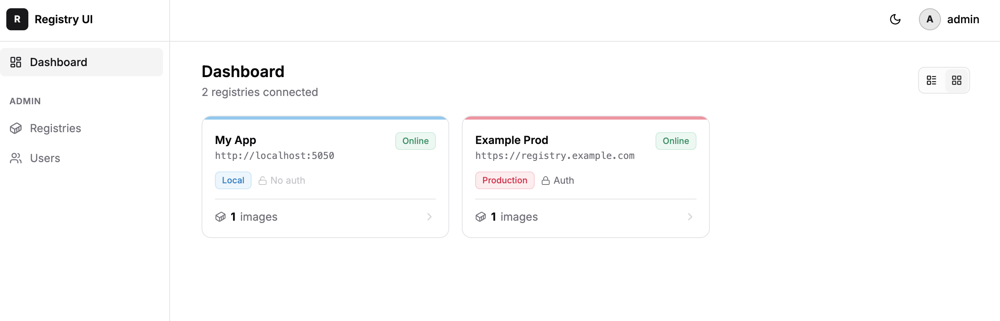
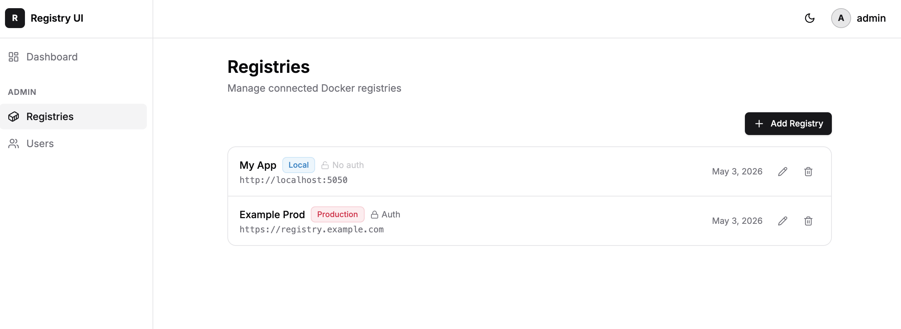
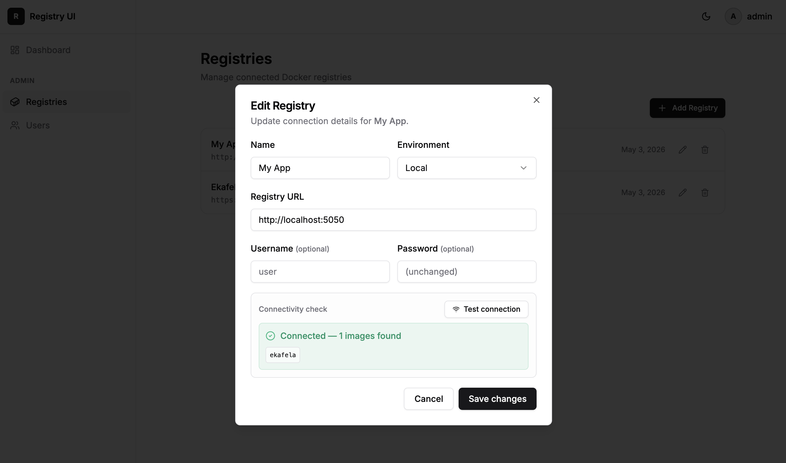
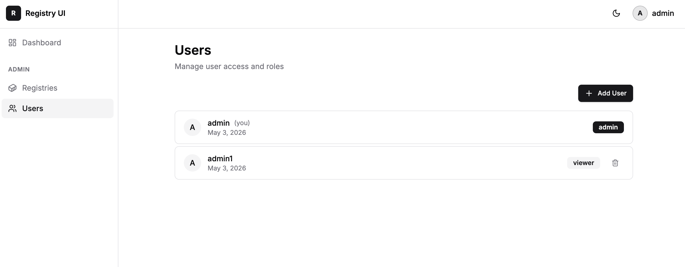
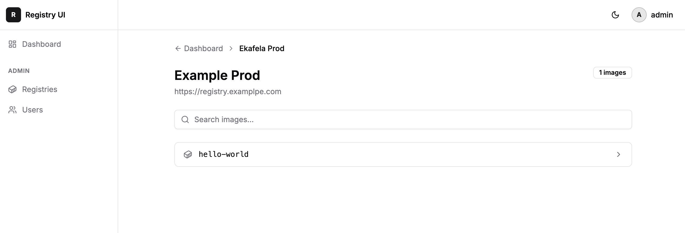

# Registry UI

A minimal, self-hosted Docker Registry browser. Connect multiple registries, manage users and roles — all from one clean interface.


## Screenshots

### Dashboard — List View


### Dashboard — Card View


### Admin — Registries


### Edit Registry with Connectivity Check


### Admin — Users


### Registry Browser


---

## Features

- **Multi-registry** — connect multiple Docker registries (with or without auth)
- **Browse** — search images, list tags, view size and digest
- **Delete** — remove image tags directly from the UI (admin only)
- **Auth** — session-based login, master admin via env vars
- **Role management** — admin and viewer roles, managed from the UI
- **Single container** — one Docker image, no external database

## Quick Start

```bash
docker run -d \
  -p 3000:3000 \
  -v registry-ui-data:/data \
  -e ADMIN_USERNAME=admin \
  -e ADMIN_PASSWORD=changeme \
  -e APP_SECRET=$(openssl rand -hex 32) \
  byteoath/registry-ui:latest
```

Open [http://localhost:3000](http://localhost:3000) and sign in.

## Docker Compose

```yaml
services:
  app:
    image: byteoath/registry-ui:latest
    ports:
      - "3000:3000"
    volumes:
      - registry-ui-data:/data
    environment:
      ADMIN_USERNAME: admin
      ADMIN_PASSWORD: changeme
      APP_SECRET: your-random-secret-here
    restart: unless-stopped

volumes:
  registry-ui-data:
```

## Environment Variables

| Variable | Required | Default | Description |
|----------|----------|---------|-------------|
| `ADMIN_USERNAME` | No | `admin` | Master admin username (seeded on first run) |
| `ADMIN_PASSWORD` | No | `admin` | Master admin password |
| `APP_SECRET` | **Yes** | — | Session encryption secret — use `openssl rand -hex 32` |
| `DB_PATH` | No | `/data/registry-ui.db` | SQLite database path |

> **Note:** `ADMIN_USERNAME` / `ADMIN_PASSWORD` only seed the initial admin. Change the password from the UI after first login.

## Connecting a Registry

1. Sign in as admin
2. Go to **Admin → Registries**
3. Click **Add Registry**
4. Enter name, URL, and optional credentials

Supports:
- Unauthenticated registries (`http://registry:5000`)
- Basic auth registries
- Token/Bearer auth registries (e.g. Docker Hub, GCR)

> To enable image deletion, start your registry with `REGISTRY_STORAGE_DELETE_ENABLED=true`.

## User Roles

| Role | Browse | Delete images | Manage users | Manage registries |
|------|--------|---------------|--------------|-------------------|
| viewer | ✅ | ❌ | ❌ | ❌ |
| admin | ✅ | ✅ | ✅ | ✅ |

Add users at **Admin → Users**.

## Tech Stack

- [Next.js 15](https://nextjs.org) — fullstack React framework
- [node:sqlite](https://nodejs.org/api/sqlite.html) — embedded database (Node.js built-in)
- [iron-session](https://github.com/vvo/iron-session) — encrypted cookie sessions
- [shadcn/ui](https://ui.shadcn.com) + [Tailwind CSS](https://tailwindcss.com) — UI

## License

MIT
